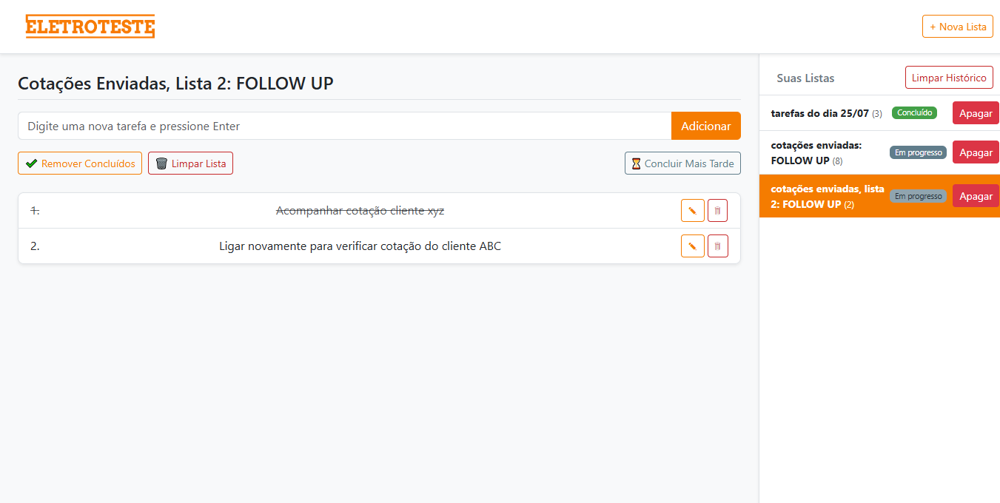
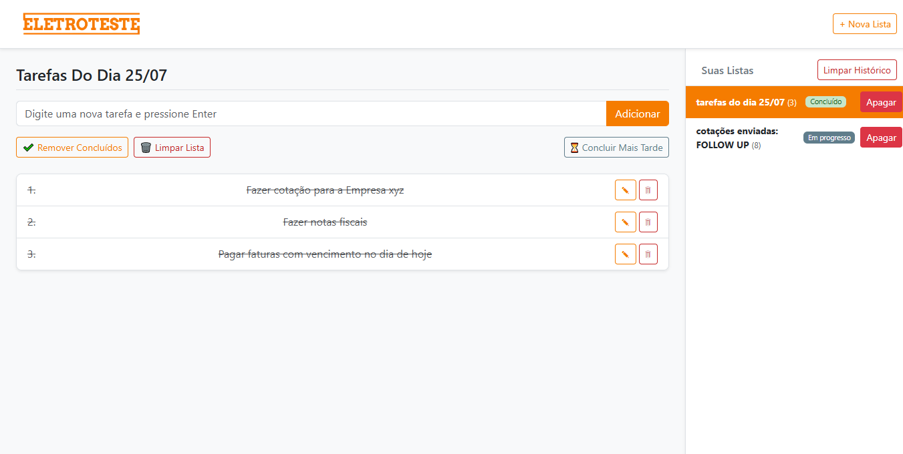
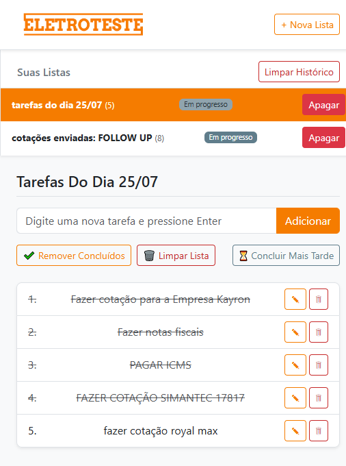

# Taskboard Eletroteste

O Taskboard Eletroteste foi desenvolvido para a empresa Eletroteste com o objetivo de acompanhar as Tarefas do dia e acompanhar e Cotações enviadas.

Para isso, criei um aplicativo capaz de Criar listas de tarefas, visualizáveis em um menu lateral com informações de status e quantidade de itens, selecionar a lista atual e adicionar itens editáveis e riscáveis.

---

## 📝 Sobre o projeto

O **Taskboard Eletroteste** permite:

- Criar listas de tarefas personalizadas
- Visualizar todas as listas no menu lateral, com status e contagem de itens
- Selecionar uma lista ativa para editar e interagir
- Adicionar tarefas editáveis
- Marcar tarefas como concluídas com um clique (riscando o texto)

Interface simples e responsiva para controle interno de atividades.

---

## 🚀 Tecnologias

Construído com:

- HTML5
- CSS3
- JavaScript
- [Bootstrap](https://getbootstrap.com/)

---

## 💻 Demonstração

### 📷 Capturas de tela

<p align="center">
  
  <br>"Lista de FOLLOW UP" aberta. Tela inicial do TaskBoard Eletroteste com as listas já criadas, ítens inclusos, e com exemplo de listas concluídas.
</p>

<p align="center">
  
    <br>"Lista de tarefas" aberta.
</p>

<p align="center">
  
  <br>"Lista de tarefas" aberta. Demonstração do Layout Responsivo.
</p>

---

### 🔗 Acesse online

Teste o projeto através do link abaixo:

👉 [Acessar Taskboard Eletroteste](https://seu-link-aqui.com)

---

## 📁 Como executar localmente

```bash
git clone https://github.com/seu-usuario/taskboard-eletroteste.git
cd taskboard-eletroteste
# Abra o arquivo index.html no navegador
```

---

## ⚖️ Licença

Desenvolvido para uso interno da **Eletroteste**. Distribuição ou uso externo não autorizado.

---

## ✨ Autor

Desenvolvido por **John Torres**
